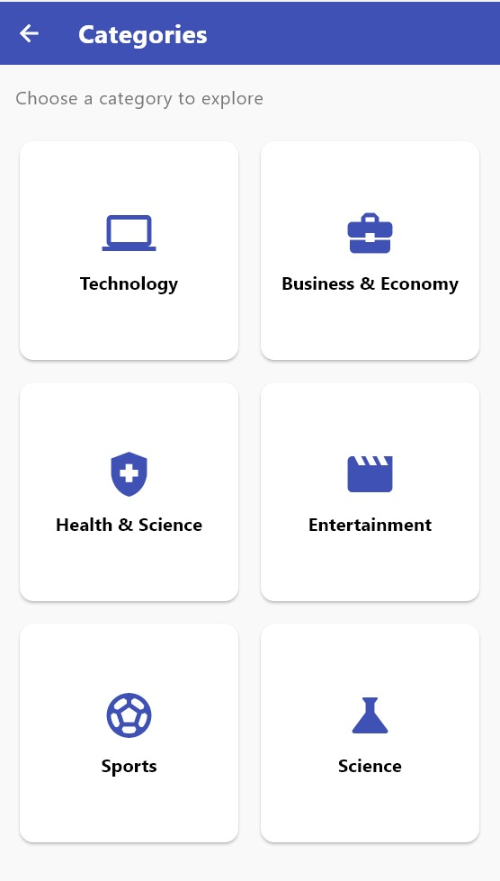
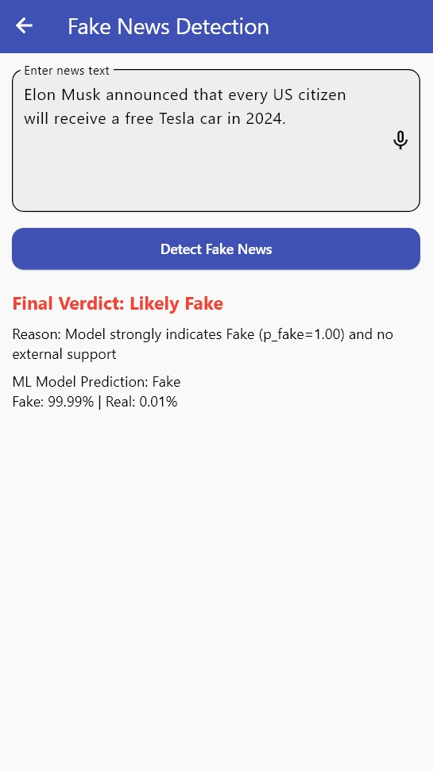
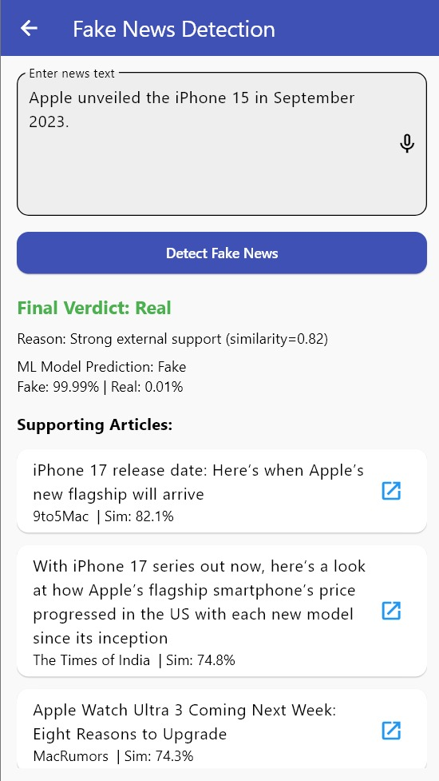
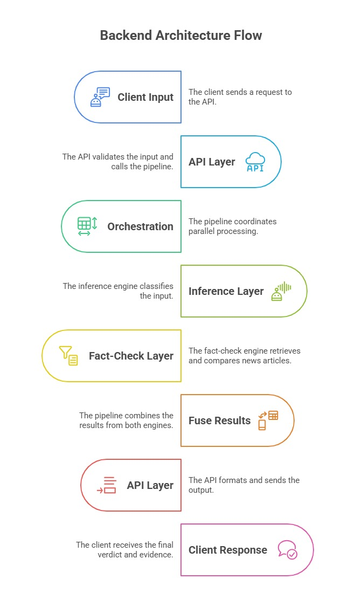

# 📰 AINewsX – AI-Powered News & Fake News Detection App

<p align="center">
  
</p>

AINewsX is a cross-platform Flutter application designed to deliver **real-time, reliable news** while actively combating misinformation.  
It aggregates top stories from **NewsAPI.org**, organizes them by topics and countries, and enhances user experience with:  

📌 **Bookmarks & Saved Articles** – offline access anytime  
🌙 **Light/Dark Mode** – seamless theme support  
🔍 **Smart Search** – find relevant news instantly  

---

## 🔑 What Makes AINewsX Unique?  

AINewsX integrates a **hybrid fake news detection system** that blends machine learning with live verification:  

📊 **BERT-based Classifier** – fine-tuned on the Kaggle Fake/Real News dataset (~45K articles), achieving **99% F1-score** for detecting misleading content.  
🌐 **Real-Time Fact-Checking** – verifies claims against live sources from NewsAPI.org using **Sentence-Transformers embeddings** for semantic similarity.  
⚡ **Fusion Logic** – combines ML probabilities with similarity-based evidence retrieval for a final verdict.  

✅ **Dual-Layered Reliability**  
- **Accuracy** – powered by deep learning classification  
- **Recency** – validated against the latest credible news sources  

---

## 🏗️ System Architecture

The following diagram illustrates the complete workflow of **AINewsX**, showing how news is fetched, processed, and verified before being presented to the user.

<p align="center">
  
</p>

### 🔄 Workflow Overview

1. **News Fetching**  
   - NewsAPI.org is used to fetch category-wise articles as well as the latest headlines for the home page.  

2. **Search & Save Features**  
   - A search bar enables exploring related news.  
   - Saved articles are stored locally using **SQLite** to enable offline access.  

3. **Fake News Detection System**  
   - User input is sent to the Python backend.  
   - **ML Inference (`inference.py`)**: Uses a fine-tuned BERT model for Fake/Real classification.  
   - **Fact Checker (`fact_checker.py`)**: Retrieves and compares claims against live sources using Sentence-Transformers.  
   - **Fusion Logic**: Combines ML probabilities with external evidence.  

4. **Final Verdict**  
   - The system outputs whether the news is *Real*, *Fake*, or *Unclear*, along with supporting sources and evidence.

By fusing AI-driven predictions with real-world verification, **AINewsX delivers a transparent, trustworthy, and next-generation news experience**—overcoming the limitations of static AI models.  

---

## ✨ Features  

- 📰 **Latest & Category-Wise News** – stay updated with breaking headlines  
- 🔍 **Smart Search** – find relevant articles instantly  
- 📑 **Save for Later** – SQLite-powered offline storage  
- 🤖 **Fake News Detection** – hybrid BERT + fact-checking  
- 🎨 **Light & Dark Mode** – clean, modern interface  

<p align="center">
  
  
  
</p>  

---

## 📱 App Screens  

### 🔍 Search & Results  
The app provides an intuitive **search bar** to explore news based on custom queries.  

<p align="center">
  
</p>  

### 📑 Saved Articles  
Articles can be saved for later reading, stored locally using **SQLite** for offline access.  

<p align="center">
  
</p>  

### 📰 Article Detail View  
Tap on any news card to view the **full article detail**.  

<p align="center">
  
</p>  

---

## 🤖 Fake News Detection  

AINewsX’s core strength is its **hybrid fake news detection pipeline**. Users can input suspicious content and get a **verdict** with evidence.  

- **Fake Example:**  

<p align="center">
  
</p>  

- **Real Example:**  

<p align="center">
  
</p>  

- **Backend Workflow (Python):**  

<p align="center">
  
</p>  

---

## 🛠️ Tech Stack  

**Frontend (Flutter App):**  
- Flutter (Dart)  
- Provider (state management)  
- SharedPreferences & SQLite (storage)  

**Backend (Python):**  
- Flask API (or FastAPI)  
- Hugging Face Transformers (BERT-based model)  
- Sentence-Transformers (semantic similarity)  

**Data & APIs:**  
- [NewsAPI.org](https://newsapi.org) – real-time news data  
- Kaggle Fake News Dataset – ~45K labeled articles  

---

## 🚀 Installation & Setup  

### 1️⃣ Clone the repo  
```bash
git clone https://github.com/your-username/AINewsX.git
cd AINewsX

